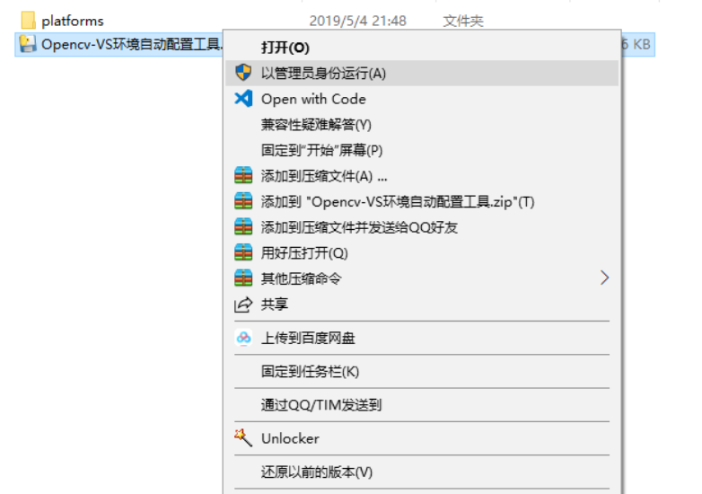
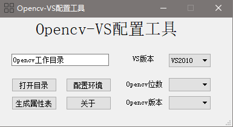
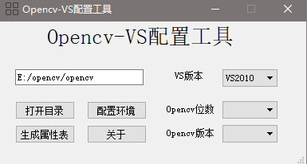
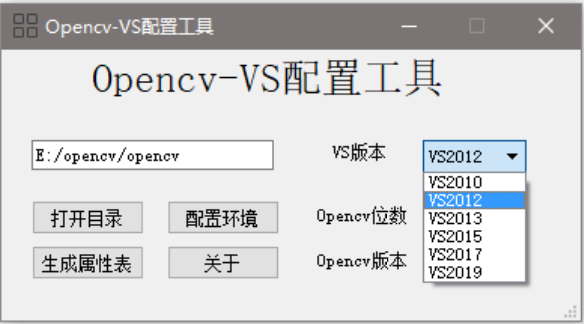
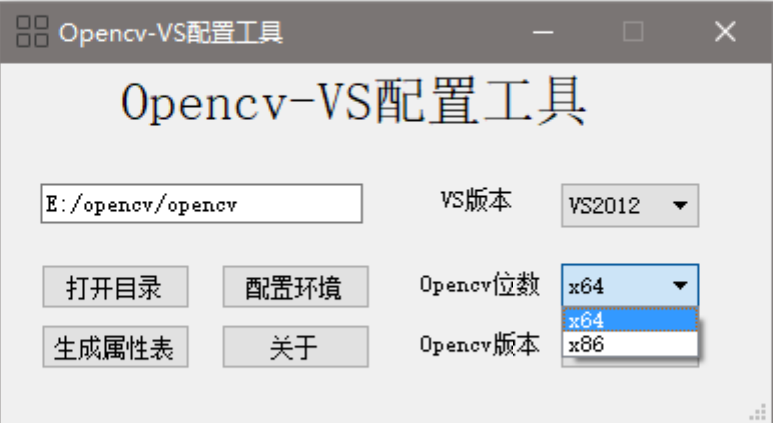
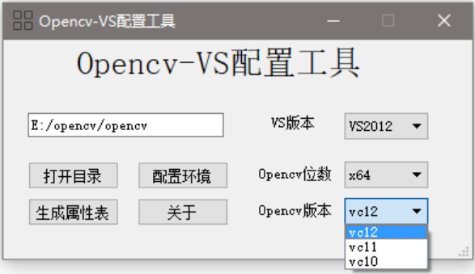
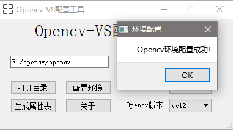
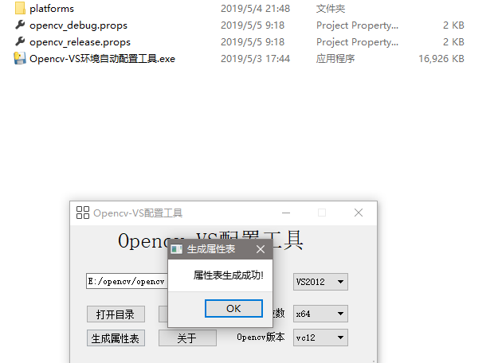
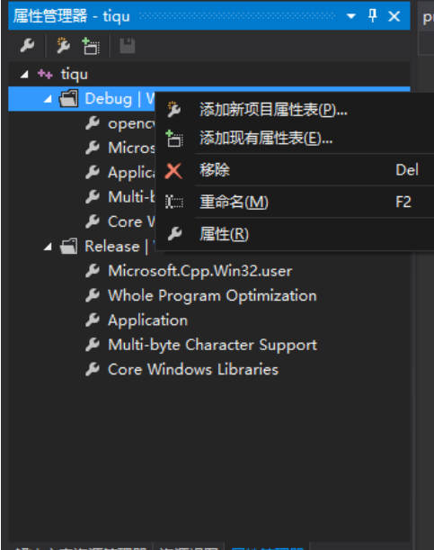
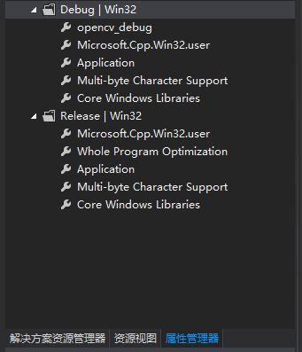

# opencv-vs环境自动配置工具
 
&emsp;&emsp;最近一直在学习pyqt,以前做东西，画界面一直是用的C++，最近一接触python画界面，感觉python真的对于护发有很大的好处。因为平时项目中，主要还是做图像方面比较多一些，也多将Visual Studio和opencv搭配使用，opencv的安装和在VS上的使用，对于初学者可能不是很友好，需要配置环境变量，然后在VS上配置属性表，之后才能使用，步骤有些繁琐，也很烦人，正好最近一直想找个小项目练练手，所以就写了这一个小的工具。
1.下载opencv，解压到某个文件夹
2.利用工具进行环境配置
&emsp;&emsp;首先如图所示，选中启动程序，**点右键以管理员身份运行（因为需要更改注册表，所以采用这个方法）**，即可进入界面

程序界面情况如下所示:
 
点击打开目录，选中opencv的安装目录(一般该目录下有bulid和sources两个文件夹)，如图所示

 

接着选择自己VS的版本
 
程序会根据opencv的安装目录解析opencv的目录结构，然后选择配置32位或者64位的属性表。
 
最后选择opencv的版本（一般采用默认版本即可，不用选择）
 

这些选定之后，就可以点击配置环境，可得
 
接着点击生成属性表，程序文件夹中就会产生debug和release版本的属性表.
 
在建立项目后，在VS的属性管理器中添加以上生成的属性表，即可使用opencv的相关库。
 
 

